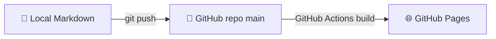

For the first tech post, let me write down how this blog itself was built.

## Why Hugo

I shortlisted three: Jekyll, Hexo, Hugo. Picked Hugo for boring reasons:

| Axis | Jekyll | Hexo | Hugo |
|---|---|---|---|
| Language | Ruby | Node.js | Go (single binary) |
| Build speed | slow | medium | **insanely fast** |
| Setup | painful | medium | **download and run** |
| CJK support | so-so | good | **good** |
| Native on GH Pages | yes | no | no (needs Actions) |

Hugo's only "downside" is that GitHub Pages won't build it for you — but a five-line GitHub
Actions workflow takes care of that.

## The architecture



Write, push, done. No local build, no dependency hell.

## A few decisions worth noting

### 1. Bilingual via `contentDir`, not filename suffix

PaperMod docs show both. I went with directory separation:

```text
content/
  zh/posts/xxx.md
  en/posts/xxx.md
```

Reason: post counts in zh and en will never be balanced, and mixing them in one folder gets
unwieldy fast.

### 2. Default language stays out of the URL subpath

```toml
defaultContentLanguageInSubdir = false
```

Chinese is default, so `/posts/xxx/` is Chinese; English lives under `/en/posts/xxx/`.
Nicer for Chinese readers, cleaner for SEO.

### 3. Theme isn't checked into the repo

`.gitignore` drops `themes/`, and GitHub Actions clones it at build time.
Smaller repo, easier theme upgrades, no submodule dance.

### 4. Turn on `hasCJKLanguage = true`

Without it, word counts and summary truncation break for Chinese posts.

## Writing a new post

```bash
# 1. New file from the archetype
hugo new content en/posts/my-new-post.md

# 2. Flip draft to false and write

# 3. Commit
git add . && git commit -m "post: my new post" && git push
```

Push, watch the Actions run go green, done.

## On the wishlist

- [ ] Auto-generated cover images
- [ ] Comments (Giscus)
- [ ] Pageview counter
- [ ] Custom domain

In due time.
